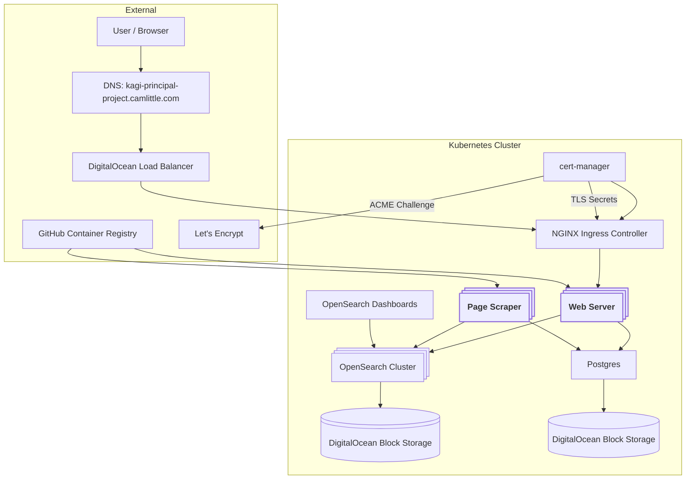

This is a search engine tailored for developer documentation.

## Architecture

This system is deployed to a kubernetes cluster, for simpler management (e.g. rolling deployment, file driven configuration, and networking).

Two applications drive the custom logic. One is a simple [web server](./web_server/) and the other is a [page scraper](./crawlers/page_scraper/).

We use cert-manager, Lets Encrypt, and NGINX to handle external network ingress, TLS, etc.

Two databases are used. Postgres acts as a queue, storing URLs discovered and scraped, and serves as a record for the sites we're allowed to scrape. OpenSearch is our search database, responsible for indexing and searching documents.



Architecture and code attempts to follow [the twelve-factor app](https://12factor.net) methodology.

## Local development

Development is configured for VSCode.

Requires a locally installed node toolchain (currently targeting v22).

Spin up service dependencies with docker compose.

```bash
docker-compose up -d
```

Migrations are run automatically for postgres.

Run the http requests in `configure_opensearch.http` to configure OpenSearch (use the recommended `humao.rest-client` VSCode extension to run from within the editor).

After dependencies are running and configured, use the launch tasks to run the web server and crawler(s).

| Service                   | URL                   |
| ------------------------- | --------------------- |
| Application Web Interface | http://localhost:3000 |
| OpenSearch Dashboards     | http://localhost:5601 |
| DB Adminer                | http://localhost:8080 |

The local postgres db uses defaults (username: `postgres`, database: `postgres`), and `password` for password.

## Deploying

This project is deployed to a managed DigitalOcean Kubernetes cluster using Helm.

### Initial setup

This expects a managed DigitalOcean Kubernetes cluster to be set up, and locally accessible via kubectl.

First, deploy these kubernetes secrets:

```yaml
kind: Secret
type: kubernetes.io/dockerconfigjson
apiVersion: v1
metadata:
  name: dockerconfigjson-github-com
stringData:
  .dockerconfigjson: |
    {"auths":{"ghcr.io":{"auth":"..."}}}


# the value for auth is base64 encoded "username:ghp_...." with a github access token
---
apiVersion: v1
kind: Secret
metadata:
  name: postgres-secret
stringData:
  POSTGRES_USER: postgres
  POSTGRES_PASSWORD: ... # a secure password
  POSTGRES_DB: postgres
  PGDATA: /var/lib/postgresql/data/pgdata
```

Helm is used to manage deployment.

```bash
helm dependency update
helm install --values ./values.yaml --set 'email=$EMAIL' $DEPLOYMENT_NAME .
```

Initial postgres migrations are automated, but subsequent migrations are manual.

```bash
# connect to the postgres instance
kubectl port-forward service/postgres 5432

# ---

# from the migrations dir
cd postgres_migrations/
# use an environment with psql (I don't have it locally)
docker run -v $PWD:/app -w /app --rm -it --entrypoint bash --network=host postgres
# run a migration - this assumes macOS docker
psql -h host.docker.internal -U postgres -d postgres --password -a -f ./migrate_{number}.sql
```

Run the http requests in `configure_opensearch.http` to configure OpenSearch (use the recommended `humao.rest-client` VSCode extension to run from within the editor), after port forwarding to the cluster.

```bash
# connect to the opensearch cluster
kubectl port-forward service/opensearch-cluster-master 9200
```

### Upgrades

Use helm to upgrade the deployment environment and configuration.

```bash
helm upgrade --values ./values.yaml --set 'email=$EMAIL' $DEPLOYMENT_NAME .
```

Use `kubectl` to redeploy jobs with new code.

```bash
kubectl rollout restart deployment/web-server
kubectl rollout restart deployment/page-scraper
```

## Monitoring

Monitoring is not robust currently.

Kubernetes logs are available.

An opensearch dashboard is running without auth. Port forward and visit http://localhost:5601 to use it.

```bash
kubectl port-forward service/prod-opensearch-dashboards 5601
```

## Data dump

If restoring to a live environment, you should take everything down first, to drop connections to the database.

```bash
kubectl scale deployment page-scraper --replicas=0
kubectl scale deployment web-server --replicas=0
```

Also remember to connect to the services appropriately (e.g. port forwarding with `kubectl`).

### Postgres

Use `pg_dump` and `pg_restore` to dump and restore data.

Example to dump:

```bash
docker run -v "$PWD:/app" -w /app --rm -it --entrypoint bash --network=host postgres
pg_dump -h host.docker.internal -U postgres > ./bulk_data/postgres.sql
```

Example to restore:

```bash
docker run -v "$PWD:/app" -w /app --rm -it --entrypoint bash --network=host postgres
dropdb -h host.docker.internal -U postgres postgres
createdb -h host.docker.internal -U postgres postgres
psql -h host.docker.internal -U postgres -d postgres -f ./bulk_data/postgres.sql
```

### OpenSearch

Use [`elasticdump`](https://github.com/elasticsearch-dump/elasticsearch-dump). This'll take a while, as this contains full text data.

Example to dump:

```bash
npx elasticdump \
  --type=data \
  --input=http://localhost:9200/page_content_1 \
  --output=./bulk_data/opensearch-data.json
```

Example to restore;

```bash
npx elasticdump \
  --type data \
  --input ./bulk_data/opensearch-data.json \
  --output http://localhost:9200/page_content_1
```
